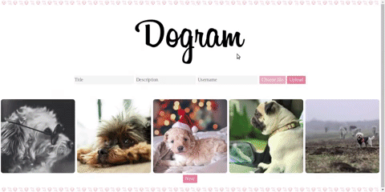

# Dogram

### Summary
Single-page imageboard application where users can both upload pictures as well as write comments on someone else's pictures.

### Tech used
  - Javascript
  - Vue.js
  - AWS S3 Cloud Storage
  - PostgreSQL databases
  - Express.js
  - Node.js
  - HTML
  - CSS

### Features
  - Imageboard with a more button to display (up to) five pictures at a time
  - Pic/comment uploader
  - Pop-up of a single picture with its description and comment section

### Set-up
This repo contains a package.json that lists all of the dependencies the project is expected to require. To install them, cd into the directory and type the following.

    $npm install

You will also need an AWS account.

### TODOs
1. Fix bugs:
    - Make text disappear out of the input boxes after uploading a picture
    - Make the more button disappear right away when I load the last bunch of 5 pictures (it works when there is 1-4 pictures)
2. Improve:
    - Make the pop-up appear where the clicked picture is. Not just at the top of the page.
2. Add new features:
    - Add before and after buttons in the pop-up to visualize other pictures
    - Add a reply function to comments
